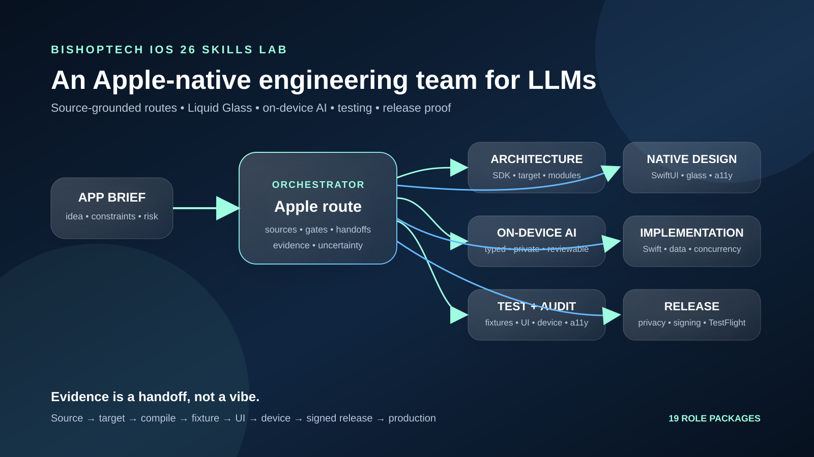
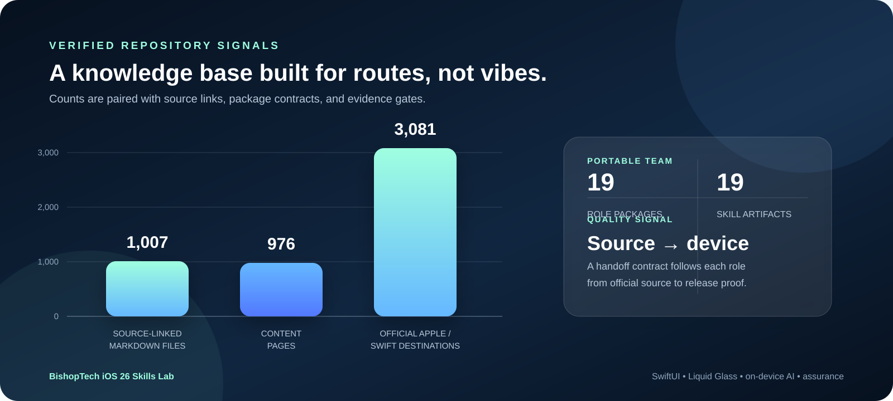
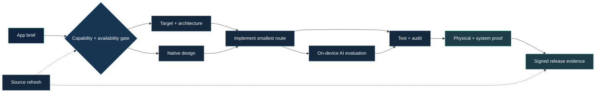
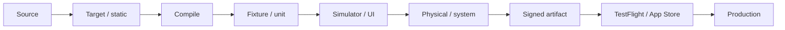

# BishopTech iOS 26 Skills Lab

<p align="left">
  <a href="https://github.com/mbishopfx/bishoptech-iosskills/stargazers"></a>
  <a href="https://github.com/mbishopfx/bishoptech-iosskills/issues"></a>
  <a href="https://github.com/mbishopfx/bishoptech-iosskills/discussions"></a>
  <a href="LICENSE"></a>
</p>

> Turn an LLM into a disciplined Apple-native engineering team.

An official-source-grounded knowledge base and portable skill bundle for building high-quality iOS apps with Swift, SwiftUI, Liquid Glass, Apple Intelligence, on-device AI, and the wider Apple SDK.

<p align="center">
  
</p>

<p align="center">
  <a href="docs/skills-catalog.md">Explore the skills</a> ·
  <a href="knowledge-base/README.md">Browse the knowledge base</a> ·
  <a href="docs/x-launch-kit.md">Share it on X</a>
</p>

## The short version

Most AI coding workflows jump from an idea to a code snippet. This lab makes the missing engineering work explicit: capability selection, target and availability gates, native composition, privacy, AI evaluation, accessibility, physical-device proof, signing, and release evidence.

It is designed to help a solo developer work like a small, specialized Apple engineering team while keeping source claims, uncertainty, and proof requirements visible.

## Verified scale

| 1,007 | 976 | 3,081 | 19 | 19 |
| ---: | ---: | ---: | ---: | ---: |
| source-linked Markdown files | content pages | official Apple / Swift destinations | role packages | portable `.skill` artifacts |

<p align="center">
  
</p>

## How a task moves



The orchestrator and every specialist package use the same handoff vocabulary: what was inspected, what the result proves, what it does not prove, and the smallest next gate.

## Choose your first route

| Your task | Start here | What you get |
| --- | --- | --- |
| Turn an app idea into a build plan | [Agentic Apple engineering team](knowledge-base/skills/packages/ios-agentic-apple-engineering-team/SKILL.md) | Role routing, source gates, handoffs, risks, and next action |
| Choose the right framework, target, or extension | [Apple SDK route](knowledge-base/skills/packages/apple-sdk-route/SKILL.md) | Capability matrix, lifecycle ownership, availability, permissions, and fallback |
| Make the UI feel native and adaptive | [SwiftUI native design](knowledge-base/skills/packages/swiftui-native-design/SKILL.md) | Screen states, navigation, Dynamic Type, accessibility, and preview coverage |
| Build restrained, functional Liquid Glass | [Liquid Glass design](knowledge-base/skills/packages/liquid-glass-design/SKILL.md) | Material roles, action hierarchy, transitions, reduced-effects fallback, and device review |
| Add private, reviewable on-device AI | [On-device AI feature](knowledge-base/skills/packages/on-device-ai-feature/SKILL.md) | Typed proposals, model readiness, refusal, user review, deterministic commits, and evaluation |
| Test, audit, and ship the real app | [Testing and release assurance](knowledge-base/skills/packages/ios-testing-and-release-assurance/SKILL.md) | Swift Testing, UI, accessibility, performance, device, archive, and TestFlight gates |

For the complete purpose, feature set, outputs, and handoff of every role, open the [full skills catalog](docs/skills-catalog.md).

## The evidence ladder



These levels are not a vanity score. A simulator run does not establish accessory behavior; an archive does not establish accessibility; a model response does not establish correctness; a TestFlight upload does not establish production behavior. Use only the levels a claim actually requires.

## All 19 role packages

<details>
<summary><strong>Plan and route</strong> · 4 packages</summary>

- [Agentic Apple engineering team](knowledge-base/skills/packages/ios-agentic-apple-engineering-team/SKILL.md) — coordinate the complete brief-to-proof workflow.
- [Apple SDK route](knowledge-base/skills/packages/apple-sdk-route/SKILL.md) — map product outcomes to frameworks, APIs, system surfaces, and gates.
- [iOS capability route planner](knowledge-base/skills/packages/ios-capability-route-planner/SKILL.md) — select the capability lane before selecting an API.
- [Project, target, and module architect](knowledge-base/skills/packages/ios-project-target-architect/SKILL.md) — design the Xcode project graph and configuration boundaries.
</details>

<details>
<summary><strong>Native design</strong> · 3 packages</summary>

- [SwiftUI native design](knowledge-base/skills/packages/swiftui-native-design/SKILL.md) — design adaptive screens, states, navigation, and input behavior.
- [Liquid Glass design](knowledge-base/skills/packages/liquid-glass-design/SKILL.md) — use glass as functional hierarchy, not decorative blur.
- [Native design and Liquid Glass verification](knowledge-base/skills/packages/ios-native-design-verification/SKILL.md) — audit whether the implementation is actually native, legible, and accessible.
</details>

<details>
<summary><strong>Intelligence and inputs</strong> · 4 packages</summary>

- [On-device AI feature](knowledge-base/skills/packages/on-device-ai-feature/SKILL.md) — design typed, private, reviewable local intelligence.
- [On-device intelligence evaluation](knowledge-base/skills/packages/ios-on-device-intelligence-evaluation/SKILL.md) — measure quality, safety, availability, latency, energy, and model drift.
- [Media, ML, and physical inputs](knowledge-base/skills/packages/ios-media-ml-and-inputs/SKILL.md) — route camera, audio, Vision, Core ML, speech, NFC, and sensor pipelines.
- [Data and device services](knowledge-base/skills/packages/ios-data-and-device-services/SKILL.md) — handle SwiftData, CloudKit, HealthKit, contacts, locations, accessories, and sync truth.
</details>

<details>
<summary><strong>System and platform surfaces</strong> · 4 packages</summary>

- [System surfaces and background](knowledge-base/skills/packages/ios-system-surfaces-and-background/SKILL.md) — design widgets, intents, extensions, providers, deep links, and background work.
- [Companion and communications](knowledge-base/skills/packages/ios-companion-communications/SKILL.md) — route Watch, CarPlay, App Clips, calls, pushes, and notifications.
- [Spatial, graphics, and games](knowledge-base/skills/packages/ios-spatial-graphics-and-games/SKILL.md) — architect AR, RealityKit, Metal, SpriteKit, GameKit, and GPU-heavy work.
- [Commerce, identity, and security](knowledge-base/skills/packages/ios-commerce-identity-and-security/SKILL.md) — keep authentication, entitlements, payments, secrets, and trust boundaries explicit.
</details>

<details>
<summary><strong>Assurance and release</strong> · 4 packages</summary>

- [Privacy, performance, and release proof](knowledge-base/skills/packages/ios-privacy-performance-release-proof/SKILL.md) — inspect privacy, diagnostics, entitlements, archives, and distribution readiness.
- [Device and release proof](knowledge-base/skills/packages/ios-device-release-proof/SKILL.md) — define what source, simulator, hardware, signing, and TestFlight evidence establishes.
- [Testing and release assurance](knowledge-base/skills/packages/ios-testing-and-release-assurance/SKILL.md) — build deterministic tests, UI flows, accessibility audits, AI fixtures, and release gates.
- [Source refresh and availability](knowledge-base/skills/packages/ios-source-refresh-and-availability/SKILL.md) — refresh routes when Apple docs, SDKs, hardware, or policy changes.
</details>

## Give an LLM a real brief

Start the orchestrator with facts instead of a vague “build me an app” prompt:

```text
App idea:
Primary user and highest-consequence failure:
Target platforms and minimum OS:
Required Apple capabilities:
Data, privacy, account, and network boundaries:
On-device AI role, if any:
Known physical devices, accessories, and system surfaces:
Current project files, targets, schemes, and tests:
Desired evidence level:
```

Ask for a route decision, official sources, availability gates, implementation plan, test matrix, device/release proof plan, open uncertainties, and the smallest next verifiable step.

## Repository map

| Path | Purpose |
| --- | --- |
| [`knowledge-base/`](knowledge-base/README.md) | Source-linked Apple and Swift research organized by route and evidence. |
| [`knowledge-base/skills/packages/`](knowledge-base/skills/packages/README.md) | Human-readable role packages with references, fixtures, and handoff contracts. |
| [`knowledge-base/skills/dist/`](knowledge-base/skills/dist) | Portable `.skill` archives for agent workflows. |
| [`docs/skills-catalog.md`](docs/skills-catalog.md) | Purpose, features, outputs, and handoffs for every role. |
| [`docs/research-log.md`](docs/research-log.md) | Concise expansion record and refresh policy. |
| [`docs/x-launch-kit.md`](docs/x-launch-kit.md) | Ready-to-post copy, thread structure, topics, and visual asset guidance. |

## Source and safety boundary

The material paraphrases and routes official Apple and Swift documentation. It is not a replacement for SDK headers, Xcode diagnostics, current Apple Developer documentation, Human Interface Guidelines, legal advice, or actual device, account, App Store, or production evidence.

The project is review-ready, not approval-guaranteed. Apple platform behavior, availability, entitlements, privacy rules, hardware support, and release policies can change. Refresh the cited source and installed SDK before relying on a version-sensitive route.

## Share it

> An open-source Apple-native engineering team for LLMs: 19 source-grounded skills for SwiftUI, Liquid Glass, on-device AI, architecture, testing, accessibility, security, physical-device audits, and release proof.

Use the [X launch kit](docs/x-launch-kit.md) for the short post, technical post, seven-part thread, topics, and the project visual.

## Contributing

Read [CONTRIBUTING.md](CONTRIBUTING.md), [SECURITY.md](SECURITY.md), and [CODE_OF_CONDUCT.md](CODE_OF_CONDUCT.md) before opening a pull request. Keep new routes source-linked, version-aware, scoped to the relevant Apple target and device, and explicit about what the evidence does not prove.

## License

MIT. See [LICENSE](LICENSE).

## Official starting points

- [Apple Developer Documentation](https://developer.apple.com/documentation/)
- [SwiftUI](https://developer.apple.com/documentation/swiftui/)
- [Human Interface Guidelines](https://developer.apple.com/design/human-interface-guidelines/)
